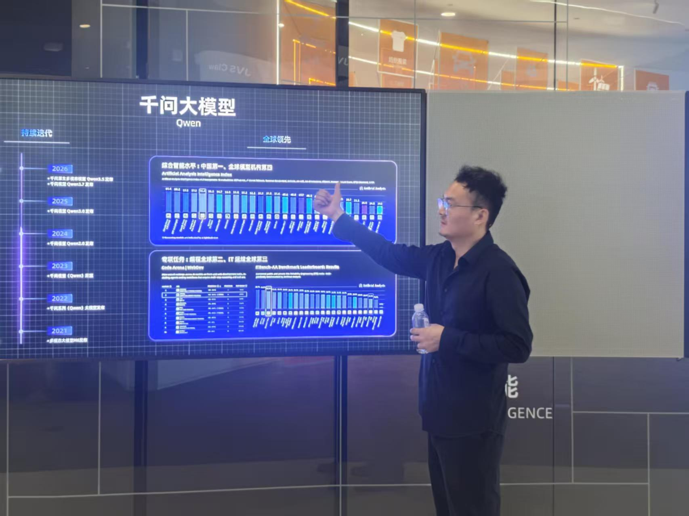
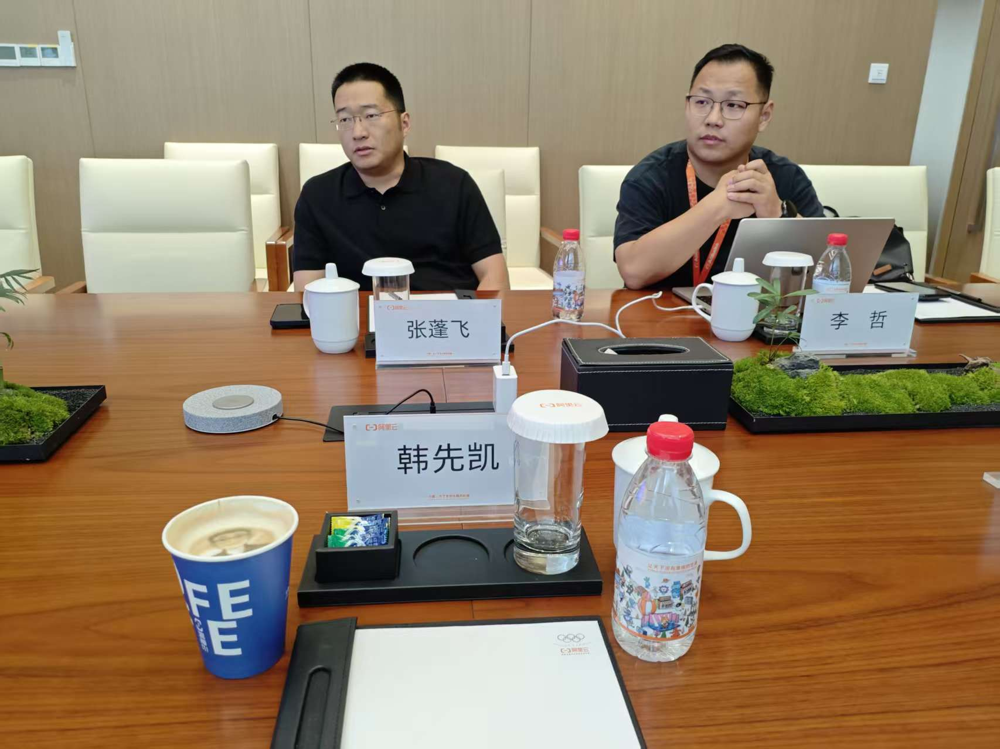
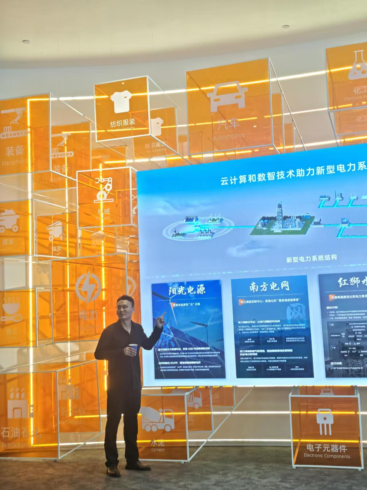
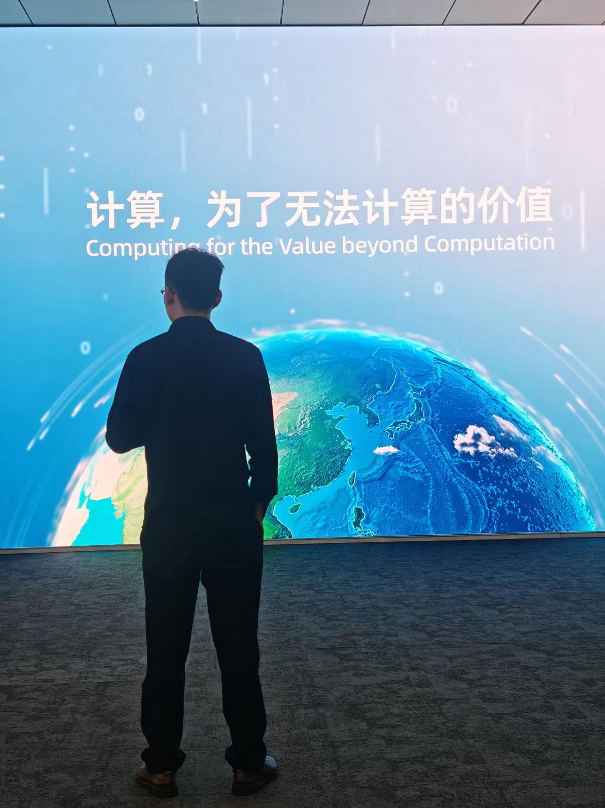

## [离谱]是谁

我叫韩先凯，网名**离谱**。

谈谈我对自己的印象吧，我想，我大抵是个有些孩子气的人。

就像我前面说的，我这人挺较真儿的。初中那会，女朋友说我不懂 QQ 空间，玩不转。结果呢，我轻轻松松就把 QQ 空间访问量做到了全国第一。

高中时候的女朋友，说我语文作文写得云里雾里，看不懂，肯定拿不了高分。我不服气，高考的时候，我语文和英语都拿了省第一。江苏卷大家都知道的，我就厚着脸皮，暂且当自己是全国第一吧。

后来，又有一任女朋友说我不适合当老师。我就写了个英语学习指南，教人学英语，现在在  GitHub  上的受欢迎程度，侥幸排到了第一。用谷歌搜索 [`英语学习指南`](https://www.google.com/search?q=%E8%8B%B1%E8%AF%AD%E5%AD%A6%E4%B9%A0%E6%8C%87%E5%8D%97&sourceid=chrome&ie=UTF-8)，你会看到排在第一的就是 [**离谱的英语学习指南**](https://github.com/byoungd/English-level-up-tips)。

## 一、个人背景

韩先凯（网名 “离谱”）是国内互联网草根创业者代表之一，以技术研发与流量运营能力起家，无公开的院校教育背景与籍贯信息披露。其创业跨度从早期个人站长赛道延伸至线下实体，业务覆盖互联网工具、内容社区、小程序、企业服务、餐饮、文旅投资等多个领域，2026 年进一步通过香港主体布局 AI 词元云计算赛道。

## 二、创业经历（按时间线）

1. 早期流量与社区创业阶段（2007-2014 年）
2. 
2007 年，入局 QQ 空间生态运营，账号总访问量达 4.6 亿，曾做到全国 QQ 空间访问量第一，完成早期流量运营经验积累。
   
2011 年，创立 “苹果酒吧论坛”，聚焦 iOS 越狱技术分享，推出网页版一键越狱工具，成为当时国内果粉圈层的头部垂直站点。

2012 年，搭建海外 WordPress 主题分享网站，巅峰时期日活独立 IP 达数百万，在海外站长圈层形成影响力。

4. 内容与工具产品探索阶段（2015-2019 年）
   
2015 年，入局在线影视赛道，其推出的影视类站点产品形态，后续成为行业同类网站的参考范本。

2016 年，联合团队进入智能法律赛道，探索法律科技产品的商业化落地。

2017 年，创作《离谱的英语学习指南》开源项目，在 GitHub 平台累计获得超 3 万 Star，长期稳居英语学习类开源项目榜首。

2018 年，规模化布局站群业务，运营多个垂直类流量站点。

6. 集团化与实体延伸阶段（2020-2025 年）

2020 年，打造 C 端爆款小程序，累计用户量突破 1300 万，验证了小程序赛道的流量与变现模式。
   
2021 年，成立江苏红力科技集团（注册资本 6000 万元），作为科技业务核心主体；同期投资度假酒店，业务从纯互联网向线下实体延伸。

2023 年，推出社交平台 “酷圈（ku0.com）”；同时通过天津主体公司布局餐饮赛道，落地餐饮管理相关业务。

2024 年 1 月，成立观雪控股（山东）有限责任公司（注册资本 2 亿元），作为控股平台整合旗下企业管理、食品零售、技术开发、文旅、商业管理等多元业务。

8. 国际化与 AI 算力布局阶段（2026 年至今）
   
2026 年 6 月 11 日，中国词元云计算有限公司在香港注册成立（香港商业登记注册号：80613667，企业类型为私人股份有限公司）；同月韩先凯出任该公司董事长，正式布局 AI 词元云计算、算力服务相关赛道，面向海外市场开展业务。
   
## 三、当前商业布局

截至 2026 年 6 月，韩先凯直接或间接控股超 10 家企业，核心主体包括：

科技类：江苏红力科技集团、南京玩有引力信息科技有限公司、中国词元云计算有限公司（香港）

控股平台：观雪控股（山东）有限责任公司

文娱与实体类：宝藏互娱文化娱乐（天津）有限公司、万理江山（天津）商业管理有限公司、万丽（天津）餐饮管理有限公司等

现在，我又多了一个新的身份：**中国词元云计算有限公司董事长**。我仍然相信，计算不是终点，真正值得较真的，是那些计算背后无法被轻易计算的价值。

  
  

  
  

